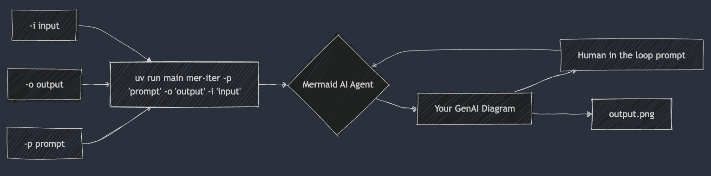

# Mermaid Diagram AI Agent
> Communicate your work with diagrams in seconds with GenAI + Mermaid

## Setup
- Install [uv](https://docs.astral.sh/uv/getting-started/installation/)
- Install dependencies `uv sync`
- Set your OpenAI API key as an environment variable `export OPENAI_API_KEY=<your_api_key>`
- Optionally setup 
  - Optionally set ANTHROPIC_API_KEY, VERTEX_API_KEY, GROQ_API_KEY as environment variables. See `.env.sample` for details.
- ✅ To run a single generation: 
  - `uv run main mer -p "Flowchart of ##setup instructions" -o "setup_diagram.png" -i "./README.md"`
  - `uv run main mer -p "state diagram of process: build prompt, generate HQ examples, iterate, build dataset, fine-tune, test, iterate, prompt " -o "fine_tune_process.png"`
  - `uv run main mer -p "pie chart title: 'Time Spent on Project Tasks', 'Coding': 40, 'Testing': 25, 'Documentation': 20, 'Meetings': 15" -o "project_time_allocation.png"`
- ✅ To run an interactive generation:
  - `uv run main mer-iter -p "Flowchart of ##setup instructions" -o "setup_diagram.png" -i "./README.md"` 
- ✅ To run a bulk-version based iteration
  - `uv run main mer-bulk -p "Flowchart of ##setup instructions" -o "setup_diagram.png" -i "./README.md" -c 5` 

## Next
- [] session ids
- [] multiple input files
- [] params for size and theme?
- [] integration into idt?

## Resources
- https://mermaid.ink/
- https://www.makotemplates.org/
- https://pypi.org/project/Mako/
- https://docs.astral.sh/uv/getting-started/features/#python-versions
- https://mermaid.js.org/syntax/examples.html
- https://ai.google.dev/api/models#models_list-shell